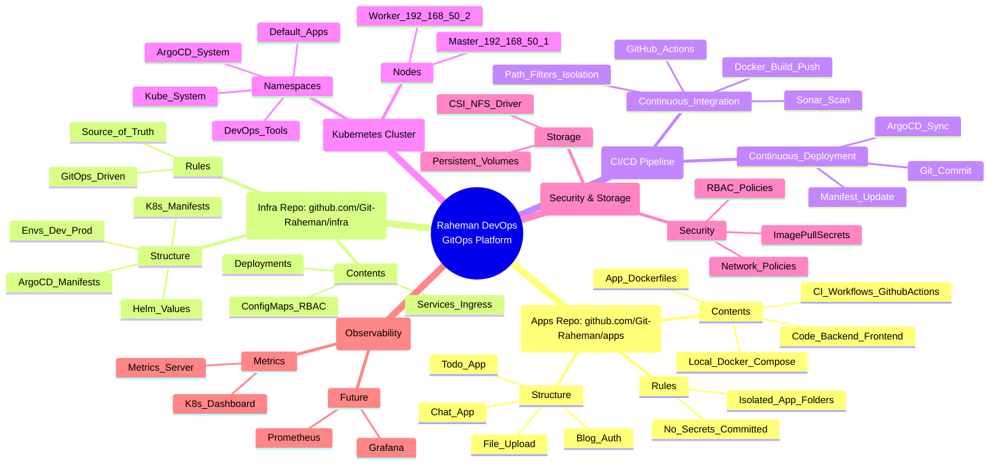
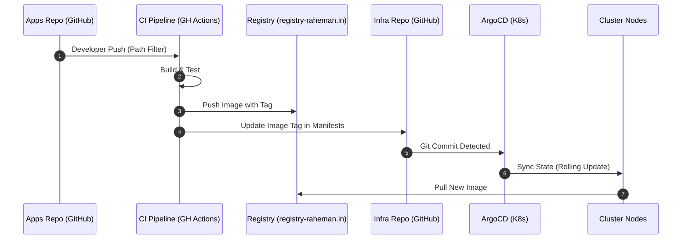

# Raheman DevOps GitOps Platform - Architecture Mind Map

This document contains the visual representation and structural breakdown of the DevOps platform. It uses Mermaid.js for rendering diagrams.

## 🧠 Platform Mind Map

## 🏗️ Repo Responsibility Mapping

| Feature | Apps Repository | Infra Repository |
| :--- | :--- | :--- |
| **Owner** | Developers | Platform/DevOps Engineers |
| **Content** | Source Code, Dockerfiles, CI Workflows | K8s Manifests, Helm Charts, ArgoCD Apps |
| **Secrets** | Local `.env` (Ignored by Git) | SealedSecrets / Vault References |
| **Versions** | Application Version (package.json) | Image Tag (values.yaml) |
| **Purpose** | Building "The Application" | Defining "The Environment" |

## 🔄 GitOps Flow Diagram

---

*Generated by Gemini CLI - Principal DevOps Platform Architect*
